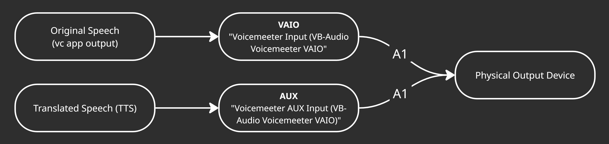

# 🎙️ Glossa

**Glossa** is a C#-based real-time interpreter app that combines **speech recognition**, **machine translation**, and **text-to-speech synthesis** using state-of-the-art APIs. It routes audio through **Voicemeeter Potato** to enable seamless input/output manipulation.

---

## 🚀 Features

### 🎧 Input (STT)
- **Google Cloud Speech-to-Text** – Streams microphone input and transcribes speech in real time.

### 🌍 Translation
- **DeepL API** – Translates recognized speech into your target language with high linguistic quality.

### 🔊 Output (TTS)
Supports multiple TTS engines:
- **ElevenLabs Multilingual v2** – Natural-sounding multilingual voice synthesis.
- **Google Cloud WaveNet** – High-fidelity text-to-speech with neural voices.
- **Windows Native Synthesizer** – Offline fallback using built-in .NET `System.Speech.Synthesis`.

All three TTS engines offer different trade-offs: **ElevenLabs** provides the highest voice quality but is relatively slower; **Google WaveNet** balances speed and quality well; and the **Native Synthesizer** is the fastest but with noticeably lower voice quality.

---

## 🧠 Modes of Operation

At startup, you can choose between:
- `1` — **Input only** (STT & translation)
- `2` — **Output only** (TTS from queued text)
- `3` — **Both** (Live interpretation mode)

---

## 🎧 Audio Routing Diagrams

Glossa uses **Voicemeeter Potato** to manage all audio streams. Below are detailed diagrams of how input and output audio are routed through the system.

---

### 🗣️ Input Audio Flow

This diagram shows how user speech is captured, translated, and sent back into a voice chat app:


> The original speech is captured by a physical microphone and routed into **Glossa** for STT + translation + TTS. The translated speech is sent into **Voicemeeter AUX**, then forwarded to **Voicemeeter VAIO**, which is set as the mic for your voice chat app via **B1**.

---

### 🔊 Output Audio Flow

This diagram shows how both original speech and translated output are routed to your speakers:



> The voice chat app’s original output is routed to **Voicemeeter VAIO**, while translated TTS from Glossa goes to **Voicemeeter AUX**. Both streams are merged and sent to your **physical output device** via **A1**.

---

> 💡 You can customize which Voicemeeter strips Glossa uses in the config — this enables flexible setups like silent TTS, split outputs, or interpretation-only modes.


---

## 🔐 API Integration

| Service        | API Used                        | Purpose           |
|----------------|----------------------------------|--------------------|
| Google Cloud   | `Speech-to-Text` + `WaveNet TTS` | Input & output     |
| DeepL          | `DeepL Translator`              | Text translation   |
| ElevenLabs     | `Multilingual v2 Streaming`     | Natural TTS output |

> ⚠️ **Note**: API keys are required and are not included in the repo. Place them in a `.env` file.

Example `.env`:
```env
GOOGLE_APPLICATION_CREDENTIALS=your-gcloud-key.json
DEEPL_API_KEY=your-deepl-key
ELEVENLABS_API_KEY=your-elevenlabs-key
